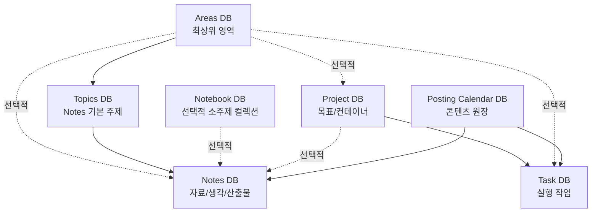

# Notion DB Constitution Design

* **작성일**: 2026-06-09
* **상태**: v0.1 합의 초안
* **목표**: Notion DB를 MCP/CLI 또는 수동 운영으로 정리하기 전에, 각 DB의 역할과 관계 원칙을 명시한다.

---

## 1. 범위

대상 DB:

1. Task DB
2. Project DB
3. Notes DB
4. Topics DB
5. Notebook DB
6. Posting Calendar DB
7. Areas DB

현재 목적은 DB 구조를 갈아엎는 것이 아니라, 이미 만들어진 시스템의 역할과 예외 규칙을 문서화하는 것이다. 특히 `Posting Calendar <-> Task` 연결 개선은 현재 급한 문제가 아니므로 이번 문서에서는 보류한다.

---

## 2. 전체 구조

---

## 3. DB별 역할

### Task DB

Task DB는 실제 실행 작업의 원장이다.

운영 원칙:

1. Task는 오늘, 이번 주, 또는 특정 시점에 실제로 처리할 수 있는 행동이어야 한다.
2. Task는 보통 하나의 Project에만 연결한다.
3. 여러 Project에 걸치는 Task는 먼저 쪼갤 수 있는지 확인한다.
4. Task의 날짜는 실행일 또는 마감일에 가깝다.
5. 중요한 Task는 가능하면 Project에 연결한다.

### Project DB

Project DB는 Task를 묶는 목표 또는 컨테이너 DB다.

Project DB 안에는 다음 유형이 함께 존재한다.

1. 목표형 Project: 완료되면 의미 있는 결과물이 생기는 단위
2. `Life`: 생활, 반복 업무, 단순 일정용 운영 컨테이너
3. `[이벤트/일지]`: 사건, 일기, 기록 보관용 컨테이너
4. 상위 Project: 분류, 폴더, 맥락 보관함

운영 원칙:

1. Project는 기본적으로 목표/결과물 단위다.
2. `Life`, `[이벤트/일지]`, 상위 Project는 목표형 Project가 아니라 컨테이너로 인정한다.
3. Project 완료는 사용자가 수동으로 판단한다.
4. 연결된 Task 완료율은 참고값일 뿐, Project 완료를 자동 결정하지 않는다.
5. Project의 날짜/기간은 참고값이다.
6. 실제 실행 날짜는 Task DB가 담당한다.
7. 상위/하위 Project 구조는 깊게 만들지 않는다.
8. 상위 Project는 진짜 목표형 Project가 아니라 분류/폴더/맥락 보관함에 가깝다.

판단 기준:

1. 끝나면 결과물이 생긴다 -> 목표형 Project
2. 생활, 반복, 단순 일정이다 -> `Life`
3. 사건, 일기, 기록이다 -> `[이벤트/일지]`
4. 분류는 필요하지만 목표형 Project로 만들기 애매하다 -> 상위 Project
5. 실제로 해야 할 행동이다 -> Task

### Notes DB

Notes DB는 자료, 생각, 리서치, 산출물의 지식 원장이다.

운영 원칙:

1. Note는 지식/자료의 최소 저장 단위다.
2. 인터넷 자료, PDF, YouTube, 직접 작성한 생각, 생산한 자료를 저장한다.
3. Note는 가능하면 Topic으로 분류한다.
4. 특정 Project에 직접 필요한 자료만 Project에 연결한다.
5. Project가 끝나도 Note는 Notes DB에 남는다.

### Topics DB

Topics DB는 주로 Notes의 주제 분류다. 실제 스키마상 Topic은 `Area`와도 연결되어 있으므로, Area보다 작은 주제 단위로 본다.

운영 원칙:

1. Topic은 Area보다 작은 주제다.
2. Topic은 주로 Notes 분류용으로 사용한다.
3. Project에 Topic을 붙일 수는 있지만 필수는 아니다.
4. Topic을 Project 분류 체계로도 강하게 쓰려고 하면 관리 부담이 커진다.

### Areas DB

Areas DB는 Task, Project, Notes, Topic을 모두 연결할 수 있는 최상위 영역 DB다.

운영 원칙:

1. Area는 Topic보다 큰 상위 영역이다.
2. Area는 Notes, Project, Task에 연결될 수 있지만 필수 분류로 강제하지 않는다.
3. Notes의 기본 분류는 Topic이며, Area는 필요할 때 상위 맥락을 제공한다.
4. Project와 Task의 기본 맥락은 Project relation이며, Area는 보조 분류로 둔다.

### Notebook DB

Notebook DB는 Topic보다 작은 소주제 컬렉션이다.

현재 Notebook은 개념상 존재하지만 실제 사용 빈도는 낮다. 따라서 필수 분류가 아니라 선택적 보조 DB로 둔다.

운영 원칙:

1. Notebook은 Topic보다 작은 소주제 묶음이다.
2. Notebook은 Project가 아니다.
3. Notebook은 완료/진행 관리 대상이 아니라 지식 묶음이다.
4. 모든 Note에 Notebook을 붙이려고 하지 않는다.
5. 특정 소주제 자료가 많이 쌓이거나 다시 볼 묶음이 필요할 때만 Notebook을 쓴다.
6. 기본 운영은 `Note + Topic`으로 충분하다.

### Posting Calendar DB

Posting Calendar DB는 글감, 키워드, 포스팅 진행을 추적하는 콘텐츠 원장이다.

운영 원칙:

1. Posting Calendar 항목은 Task 자체가 아니다.
2. Posting Calendar는 글감, 키워드, 작성 진행, 발행 후보를 관리한다.
3. 실행 작업은 Task DB에 만든다.
4. Posting Calendar와 Task는 이미 연결되어 있으며, Task 쪽에서 Posting Calendar 페이지 제목이 바로 보이는 현재 방식은 유지한다.
5. Posting Calendar <-> Task 자동화 개선은 현재 보류한다.

---

## 4. 관계 원칙

### Project -> Task

`Project -> Task`는 사실상 1:N 관계로 운영한다.

1. Project는 여러 Task를 가질 수 있다.
2. Task는 보통 하나의 Project에만 연결한다.
3. 여러 Project에 걸치는 Task는 쪼개거나 대표 Project 하나를 선택한다.
4. Project 완료는 Task 완료율이 아니라 사용자의 수동 판단으로 결정한다.

### Areas -> Topics

`Area -> Topic`은 상위 영역과 하위 주제 관계다.

1. Area는 Topic보다 큰 상위 영역이다.
2. Topic은 가능하면 Area와 연결할 수 있다.
3. Area를 Task/Project/Note에 직접 붙일 수 있지만, 남발하지 않는다.

### Notes -> Topics

`Topic`은 Notes의 기본 주제 분류 체계다.

1. Note에는 가능하면 Topic을 붙인다.
2. Topic은 대주제다.
3. Topic은 주로 Notes 분류에 사용한다.

### Notes -> Notebook

`Notebook`은 선택적 소주제 컬렉션이다.

1. Notebook은 필수가 아니다.
2. Topic만으로 충분하면 Notebook은 비워둬도 된다.
3. Notebook 사용률을 억지로 높이려고 하지 않는다.

### Project -> Notes

`Project -> Notes`는 필요할 때만 쓰는 보조 연결이다.

1. 특정 Project에 직접 필요한 자료만 연결한다.
2. 모든 리서치 자료를 Project에 억지로 연결하지 않는다.
3. 장기 보관/분류는 Topic이 담당하고, 단기 활용 맥락은 Project가 담당한다.

### Posting Calendar -> Task

이번 문서에서는 보류한다.

현재 전제:

1. Posting Calendar 항목 자체를 Task로 복제하지 않는다.
2. 실행할 작업만 Task로 생성하고 Posting Calendar와 연결한다.
3. 현재 연결은 이미 작동하고 있으므로 급한 정리 대상이 아니다.

---

## 5. MCP/CLI 운영 원칙

Notion MCP/CLI는 상시 자동화 엔진이 아니라 점검, 정비, 마이그레이션 도구로 사용한다.

운영 원칙:

1. Notion 자체 기능으로 표현 가능한 규칙은 Notion 안에 둔다.
2. MCP/CLI는 반복 감시보다 스키마 분석, 일괄 정비, 규칙 위반 검사, 마이그레이션에 사용한다.
3. 토큰과 호출 비용을 줄이기 위해 MCP/CLI를 상시 동기화 엔진처럼 쓰지 않는다.
4. 실제 DB를 가져올 때는 먼저 스키마만 조회하고, 페이지 데이터 전체 조회는 필요한 범위로 제한한다.

---

## 6. 다음 작업

실제 Notion DB 정리는 다음 순서로 진행한다.

1. 7개 DB의 스키마를 조회한다.
2. 속성명, relation, rollup, formula, status 속성을 기록한다.
3. 이 문서의 헌법과 실제 스키마가 충돌하는 부분을 표시한다.
4. 속성 추가 없이 정리 가능한 운영 규칙을 먼저 제안한다.
5. 필요한 경우에만 relation, rollup, formula, 버튼, 자동화 변경안을 별도 문서로 분리한다.

성공 기준:

1. 각 DB의 역할이 한 문장으로 설명된다.
2. 각 relation의 의미가 명확하다.
3. 컨테이너성 Project와 목표형 Project의 차이가 명시된다.
4. Notebook은 선택적 보조 DB로 격하된다.
5. MCP/CLI는 상시 자동화가 아니라 정비 도구로 제한된다.
